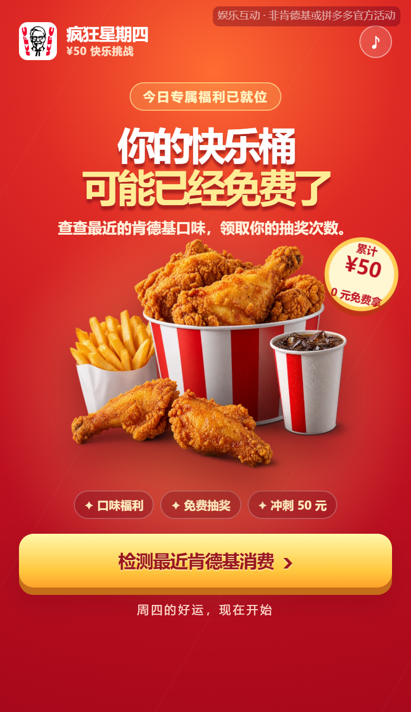
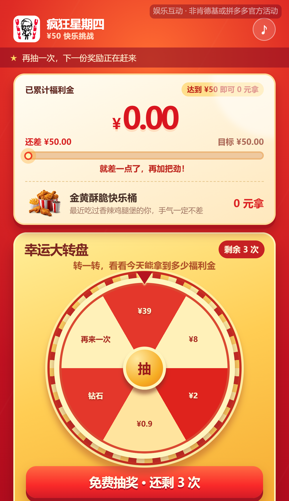
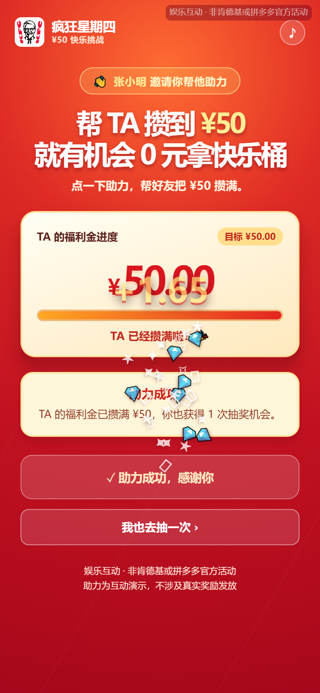
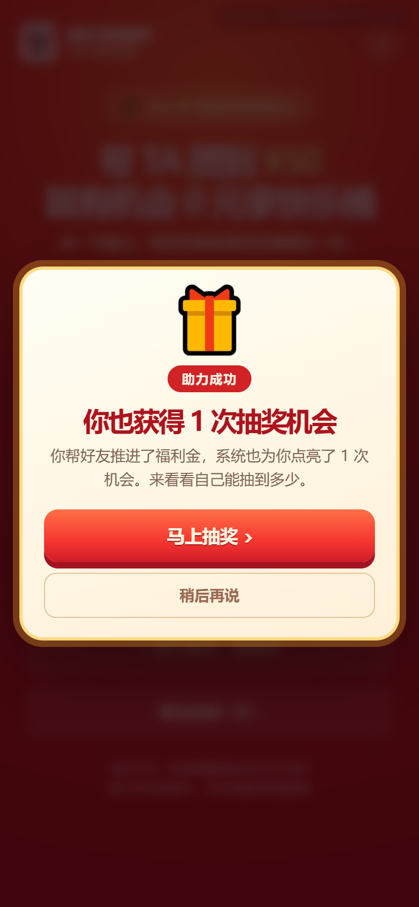
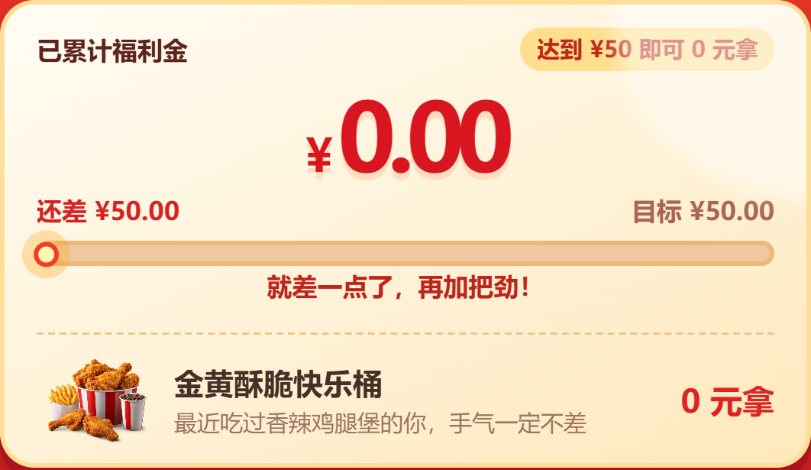

# 疯狂星期四 · ¥50 快乐桶挑战

一个纯前端的「疯狂星期四」趣味互动 H5 页面：检测你的「最近消费口味」，解锁抽奖次数，转动幸运大转盘攒福利金，攒满 ¥50 就能 0 元拿下快乐桶。

带好友助力玩法 —— 分享链接给朋友，朋友点进来就是**助力落地页**，点一下即可帮好友把福利金攒满，同时自己也能获得 1 次抽奖机会。

**在线体验：<https://cwser.github.io/kfc-v50/>**

> 手机端打开效果最佳。页面完全跑在浏览器里，没有后端、没有数据库、不需要安装任何东西。

---

## 效果图

### 开屏页

首屏直接给出核心利益点，主按钮一屏可见，不需要滚动。



### 幸运大转盘

7 个扇区（¥39 / ¥8 / ¥2 / ¥0.9 / 钻石 / 再来一次），抽奖次数实时同步到右上角角标。



### 好友助力落地页

好友从分享链接进入后，看到的是这个页面：显示「谁邀请你帮他助力」+ TA 的实时进度。



### 助力成功弹窗

朋友帮你助力后，自己也会拿到 1 次抽奖机会 —— 这是分享裂变的关键一环。



### 累计福利金卡片

顶部常驻的进度卡，含金额、进度条与商品条（并入卡内，不额外占高度）。



---

## 页面流程

```
开屏页
  └─ 点击「检测最近肯德基消费」
       └─ 消费识别小票（演出式，随机生成口味偏好 / 近期产品）
            └─ 发放 3 次抽奖机会
                 └─ 幸运大转盘（可反复抽）
                      ├─ 抽到金额  → 福利金累加，进度条推进
                      ├─ 抽到钻石  → 解锁冲刺模式
                      ├─ 抽到再来一次 → 返还次数
                      └─ 攒满 ¥50  → 通关结算页

分享链接（?from=张三&av=48.35）
  └─ 好友打开 → 助力落地页（不是开屏页）
       └─ 点「帮 TA 助力」→ 数字滚动攒满 ¥50 + 粒子特效
            └─ 弹出「你也获得 1 次抽奖机会」
                 └─ 点「马上抽奖」→ 直接进转盘，次数 +1
```

**分享参数说明**：分享链接会带 `?from=<昵称>&av=<当前金额>` 两个参数，好友打开时若检测到这两个参数，就直接渲染助力落地页而非开屏页。参数在页面加载时写入地址栏（`history.replaceState`），所以用微信右上角「···」原生分享也能带上 —— 这是很多人容易踩的坑：只有页面内分享按钮拼参数，原生分享会丢。

---

## 在自己的 GitHub 上线

不需要服务器、不需要域名，全程白嫖 GitHub Pages，三分钟搞定。

### 第 1 步：Fork 本仓库

打开 <https://github.com/cwser/kfc-v50>，点页面**右上角**的 **Fork** 按钮（在 Star / Watch 图标旁边），然后点 **Create fork**。

Fork 完成后，你就有了一个自己名下的副本，地址形如：

```
https://github.com/<你的用户名>/kfc-v50
```

### 第 2 步：开启 GitHub Pages

进入你 fork 后的仓库，按顺序点：

**Settings** → 左侧栏 **Pages** → **Build and deployment**

- **Source** 选 `Deploy from a branch`
- **Branch** 选 `main`，目录选 `/ (root)`
- 点 **Save**

保存后等 1–2 分钟（首次部署可能要 3–5 分钟），页面顶部会出现绿色提示框，显示你的访问地址。

### 第 3 步：访问

地址固定为：

```
https://<你的用户名>.github.io/kfc-v50/
```

例如用户名叫 `zhangsan`，就是 <https://zhangsan.github.io/kfc-v50/>。

在手机上打开这个链接，或者把链接发给朋友测试助力流程。

### 第 4 步：改内容（可选）

所有代码都是纯静态文件，改完直接提交即可，GitHub Pages 会自动重新构建。

| 想改什么 | 改哪个文件 |
|---|---|
| 文案、页面结构 | `index.html` |
| 基础样式、动画 | `style.css` |
| 移动端适配覆盖层 | `mobile-fix.css` |
| 抽奖逻辑、金额、扇区 | `app.js` |
| 助力页逻辑、分享参数 | `boost.js` |
| 桶装炸鸡图 | `chicken-feast.webp` |
| 分享卡片封面 | `share-cover.jpg` |

改完执行：

```bash
git add -A
git commit -m "改成我自己的内容"
git push
```

推上去之后，线上地址会自动更新（可能有几十秒缓存延迟，强制刷新一下）。

### 常见问题

**Q：访问 404 怎么办？**
A：先确认 Settings → Pages 里 Branch 选的是 `main` + `/ (root)`，且已点 Save。再看仓库的 **Actions** 标签页，等构建任务跑完变成绿色勾。

**Q：改了代码线上没变化？**
A：GitHub Pages 有 CDN 缓存，等 1–2 分钟并用无痕窗口 / 强制刷新（手机端可在链接后加 `?v=2`）打开。

**Q：想在本地预览？**
A：直接双击 `index.html` 就能看。但**带动分享参数的页面必须在 HTTP 服务下才能测** —— 因为 `history.replaceState` 在 `file://` 协议下会抛 SecurityError。用一条命令起个本地服务：

```bash
python -m http.server 8000
```

然后访问 <http://localhost:8000>。

---

## 技术说明

- **纯静态**：只有 HTML / CSS / JS + 一张 webp 图片，没有构建步骤、没有依赖包、没有 `npm install`
- **零后端**：所有状态（抽奖次数、福利金、昵称）都存在浏览器 `localStorage` / `sessionStorage` 里，刷新页面进度会重置
- **响应式**：媒体查询按宽度分档（`≤480px` / `≤380px`），用 `dvh` 单位与 `env(safe-area-inset-bottom)` 适配移动端浏览器底栏
- **分享参数**：`sessionStorage.kfc_is_sharer` 区分分享者与访客，访客带 `?from=&av=` 进助力页
- **无障碍**：动画遵循 `prefers-reduced-motion`，系统开启「减弱动态效果」时自动降级

### 文件结构

```
.
├── index.html            # 页面结构
├── style.css             # 基础样式与动画
├── mobile-fix.css        # 移动端适配覆盖层（不改动 style.css）
├── app.js                # 抽奖 / 结算 / 分享逻辑
├── boost.js              # 好友助力落地页 + 分享参数同步
├── chicken-feast.webp    # 桶装炸鸡主视觉
├── share-cover.jpg       # 分享卡片封面（og:image）
└── docs/                 # README 效果图
```

### 本地开发环境

无需任何依赖。建议用下面两种方式之一：

```bash
# 方式一：Python 自带
python -m http.server 8000

# 方式二：Node
npx serve .
```

---

## 免责声明

本项目为**前端技术演示与娱乐互动 Demo**：

- 与肯德基（KFC）、拼多多及各品牌官方**无任何关联**，非官方活动
- 「近期消费检测」为演出式模拟，**不读取任何真实订单或用户数据**
- 抽奖、福利金、助力进度均为本地演出效果，**不涉及任何真实奖励发放**
- 页面顶部的 KFC 标识从公开媒体资源地址加载，离线环境下会显示文字回退

请勿将本页面用于任何商业用途或误导性传播。商标与品牌权益归各自权利人所有。
